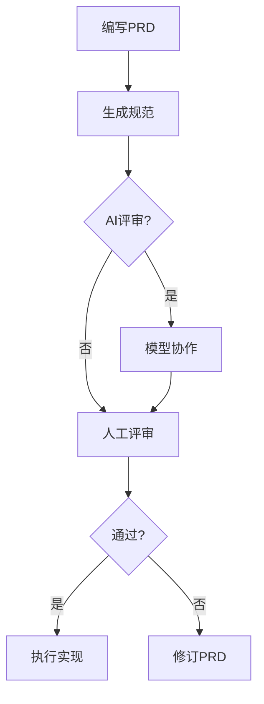

# My Claude Code Workflow Patterns

[English](README_EN.md)

## 功能特性

- **PRD 驱动开发**：将产品需求转化为可执行的技术规范
- **AI 协作**：支持与 Zen-O3 和 Gemini-Pro 模型协作优化文档
- **版本控制友好**：生成带时间戳的 Markdown 文档，支持评审工作流
- **模块化任务分组**：按文件依赖和功能上下文智能聚类任务
- **双语支持**：中文文档输出，保留专业术语英文原文(可配置)
- **Sub Agent**: Sub agent for Task Group

## 安装指南

### 前置要求
使用前请确保在项目目录下创建 docs/specs 文件夹

### 安装方式
**全局安装(推荐)**
将 agents 和 commands 文件夹内容复制到用户主目录的 ~/.claude/ 文件夹中

**项目本地安装**
将 agents 和 commands 文件夹内容复制到项目根目录的 .claude/ 文件夹中

### 可选组件
1. [Zen MCP Server](https://github.com/BeehiveInnovations/zen-mcp-server) (用于 O3 模型集成)
2. [Gemini CLI](https://github.com/google-gemini/gemini-cli) (用于 Gemini-Pro 协作)

## 使用流程

### 1. 创建 PRD 文档

编写详细的产品需求
`docs/specs/prd.txt`

### 2. 生成开发任务规范文档
```bash
# 基础生成
/prd-task-doc

# 带 AI 协作 O3 优化 + Gemini 评审
/prd-task-doc -zen o3 -review pro
```

### 3. 人工评审
```markdown
评审生成的文件:(如果有问题可以直接与Claude Code沟通修改)
docs/specs/[日期]_[功能].md
```

### 4. 执行实现
```bash
/clear            # 可选上下文重置
/impl-task xxx.md # 开始实现
```

## 命令参考

### 基础语法
```bash
/prd-task-doc [flags]
```

### 参数选项
| 参数       | 值        | 说明                          |
|------------|-----------|--------------------------------------|
| `-zen`     | o3/pro    | 优化模型 (默认: o3)     |
| `-review`  | pro/o3    | 评审模型 (默认: pro)          |

### 使用示例
```bash
# O3 优化 + Gemini 评审
/prd-task-doc -zen o3 -review pro

# Gemini 优化 + O3 评审
/prd-task-doc -zen pro -review o3

# 快速生成(仅使用 Claude Code)
/prd-task-doc
```

## 配置说明

### 语言自定义
修改文档输出语言:
1. 编辑 `commands/prd-task-doc.md` 第 218 行
2. 修改 `Doc Output` 指令

### 模型配置
使用自定义模型:
1. 更新 "Model Collaboration Process" 部分(Step 2)
2. 添加您的模型集成细节

## 常见问题

### Q: 如何修改输出语言?
A: 编辑 prd-task-doc.md 第 218 行的 `Doc Output` 指令

### Q: 如何配置不同模型?
A: 修改参数处理部分 Step 2 中的模型调用描述

### Q: 生成的文档存放在哪里?
A: 在 `docs/specs/` 目录下，文件名格式为 `YYYY_MM_DD_功能.md`

## 工作流图示


