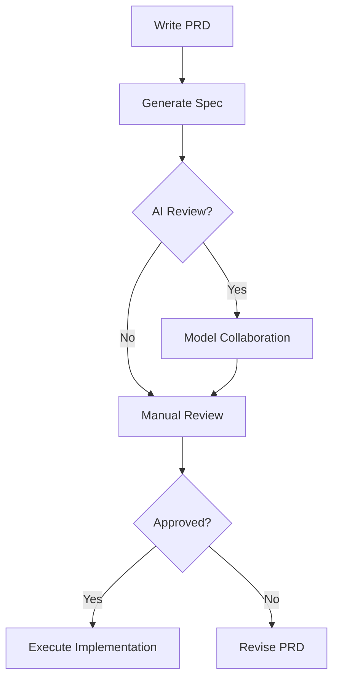

# My Claude Code Workflow Patterns

## Features

- **PRD-driven Development**：Convert PRD requirements into actionable technical specifications
- **AI Collaboration**：Integrates with Zen-O3 and Gemini-Pro models for document optimization
- **Version Control Ready**：Generates time-stamped Markdown documents with review workflows
- **Modular Task Grouping**：Intelligent task clustering by file dependencies and functional context
- **Bilingual Support**：Bilingual documentation with preserved technical terminology (configurable)
- **Sub Agent**: Sub agent for Task Group

## Installation

### Prerequisites
Ensure to create a docs/specs folder in your project directory before use

### Installation Methods
**Global Installation (Recommended)**
Copy the contents of both agents and commands folders to the ~/.claude/ directory in your home folder

**Project-local Installation**
Copy the contents of both agents and commands folders to a .claude/ directory in your project root

### Optional Components
1. [Zen MCP Server](https://github.com/BeehiveInnovations/zen-mcp-server) (For O3 model integration)
2. [Gemini CLI](https://github.com/google-gemini/gemini-cli) (For Gemini-Pro collaboration)

## Usage Workflow

### 1. Create PRD Document

Write detailed product requirements
`docs/specs/prd.txt`


### 2. Generate Task Specification
```bash
# Basic generation
/prd-task-doc

# With model collaboration, O3 optimization + Gemini review
/prd-task-doc -zen o3 -review pro
```

### 3. Manual Review
```markdown
Review generated file:(If you have any questions, you can communicate directly with Claude Code for modification)
docs/specs/[date]_[feature].md
```

### 4. Execute Implementation
```bash
/clear            # Optional context reset
/impl-task xxx.md # Start implementation
```

## Command Reference

### Basic Syntax
```bash
/prd-task-doc [flags]
```

### Flags
| Flag       | Values    | Description                          |
|------------|-----------|--------------------------------------|
| `-zen`     | o3/pro    | Optimization model (default: o3)     |
| `-review`  | pro/o3    | Review model (default: pro)          |

### Examples
```bash
# O3 optimization + Gemini review
/prd-task-doc -zen o3 -review pro

# Gemini optimization + O3 review
/prd-task-doc -zen pro -review o3

# Quick generation without only Claude Code
/prd-task-doc
```

## Configuration

### Language Customization
To change documentation language:
1. Edit line 218 in `commands/prd-task-doc.md`
2. Modify `Doc Output` instruction

### Model Configuration
To use custom models:
1. Update "Model Collaboration Process" section (Step 2)
2. Add your model integration details

## FAQ

### Q: How to modify output language?
A: Edit the `Doc Output` instruction at line 218 of prd-task-doc.md

### Q: How to configure different models?
A: Modify the model invocation descriptions in Step 2 of the parameter processing section

### Q: Where are generated documents stored?
A: In `docs/specs/` with filename format `YYYY_MM_DD_feature.md`

## Workflow Diagram


